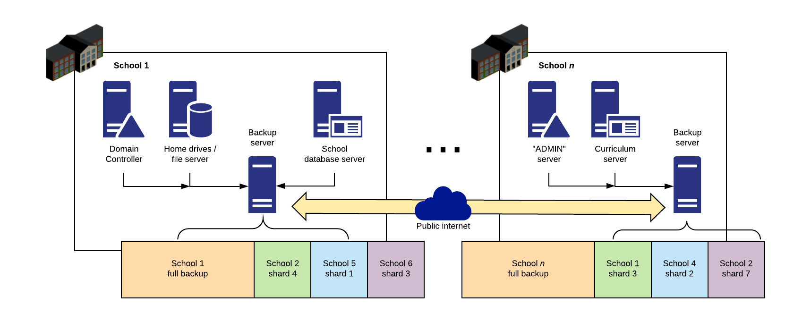
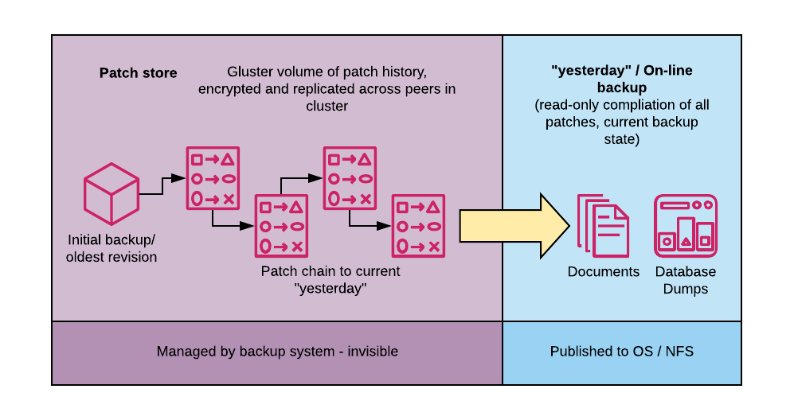

# CoStor Server
## Private cloud, distributed, peer-to-peer, encrypted backup.

Zero-touch offsite backups for confederations, school districts or small businesses with multiple sites.

**Note:** the file storage and changelog architecture has been changed significantly since induction and no 
longer uses a single patch chain for an entire volume, opting for fingerprint based per-file storage.

This project makes use of concepts outlined in this paper from Paul Anderson and Le Zhang: [Fast and secure laptop backups with encrypted de-duplication](http://homepages.inf.ed.ac.uk/dcspaul/homepage/live/pdf/lisa2010.pdf)

|  |  |
| --- | --- |
| Multi-site replication concept | Local site backup volume data structure |

### Technologies:
 - ~~**GlusterFS**: Scalable network filesystem with geo-replication and sharding. [gluster.org](https://www.gluster.org)~~
 - **Django**: Web framework with strong ORM, built in authentication and security best-practices. [djangoproject.com](https://www.djangoproject.com)
 - **PonyORM**: Python ORM (used for backup client)

(C) Robert P 2019-20. University of Edinburgh Honours Project (inf.ed.ac.uk)
